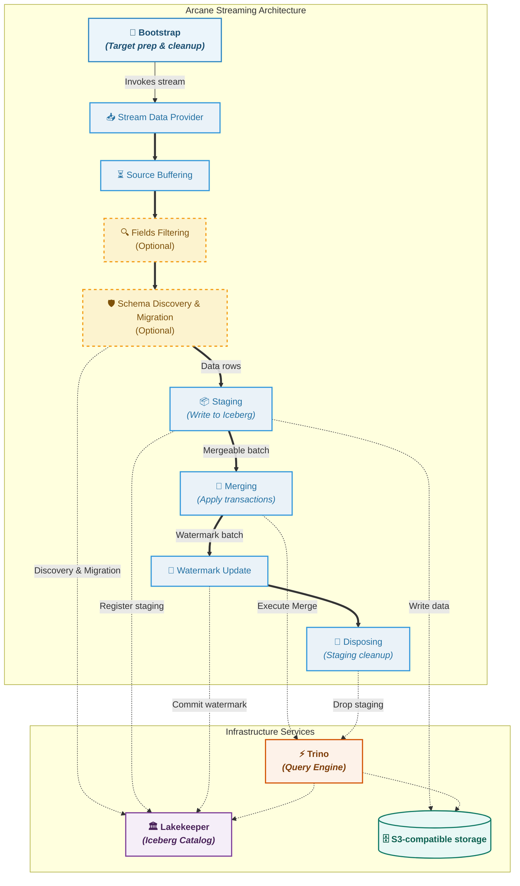

```mermaid
graph TD
    %% Modern Professional Theme & Styling
    classDef bootstrap fill:#ebf5fb,stroke:#2e86c1,stroke-width:2px,color:#1b4f72,font-weight:bold;
    classDef core fill:#eaf2f8,stroke:#3498db,stroke-width:2px,color:#2471a3;
    classDef optional fill:#fcf3cf,stroke:#f39c12,stroke-width:2px,stroke-dasharray: 5 5,color:#7e5109;
    classDef storage fill:#e8f8f5,stroke:#117a65,stroke-width:2px,color:#0e6251,font-weight:bold;
    classDef catalog fill:#f5eef8,stroke:#7d3c98,stroke-width:2px,color:#4a235a,font-weight:bold;
    classDef engine fill:#fdf2e9,stroke:#d35400,stroke-width:2px,color:#7e3d07,font-weight:bold;

    subgraph Arcane [Arcane Streaming Architecture]
        direction TB
        Bootstrap["🚀 Bootstrap<br/><i>(Target prep & cleanup)</i>"]:::bootstrap
        StreamDataProvider["📥 Stream Data Provider"]:::core
        SourceBuffering["⏳ Source Buffering"]:::core
        FieldsFiltering["🔍 Fields Filtering<br/>(Optional)"]:::optional
        SchemaDiscoveryMigration["🛡️ Schema Discovery & Migration<br/>(Optional)"]:::optional
        Staging["📦 Staging<br/><i>(Write to Iceberg)</i>"]:::core
        Merging["🔄 Merging<br/><i>(Apply transactions)</i>"]:::core
        WatermarkUpdate["💾 Watermark Update"]:::core
        Disposing["🧹 Disposing<br/><i>(Staging cleanup)</i>"]:::core
    end

    subgraph Infrastructure [Infrastructure Services]
        Lakekeeper["🏛️ Lakekeeper<br/><i>(Iceberg Catalog)</i>"]:::catalog
        S3[("🗄️ S3-compatible storage")]:::storage
        Trino["⚡ Trino<br/><i>(Query Engine)</i>"]:::engine
    end

    %% Internal pipeline connections & Data Flows
    Bootstrap -->|Invokes stream| StreamDataProvider
    StreamDataProvider ==> SourceBuffering
    SourceBuffering ==> FieldsFiltering
    FieldsFiltering ==> SchemaDiscoveryMigration
    SchemaDiscoveryMigration ==>|"Data rows"| Staging
    Staging ==>|"Mergeable batch"| Merging
    Merging ==>|"Watermark batch"| WatermarkUpdate
    WatermarkUpdate ==> Disposing

    %% External Data and Command Interactions
    SchemaDiscoveryMigration -.->|"Discovery & Migration"| Lakekeeper
    Staging -.->|"Write data"| S3
    Staging -.->|"Register staging"| Lakekeeper

    Merging -.->|"Execute Merge"| Trino
    WatermarkUpdate -.->|"Commit watermark"| Lakekeeper
    Disposing -.->|"Drop staging"| Trino

    %% Trino Interactions
    Trino -.-> Lakekeeper
    Trino -.-> S3
```