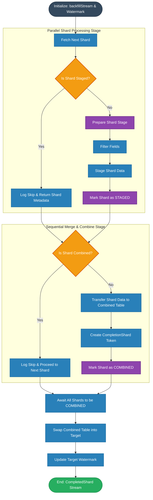

# DefaultBackfillOverwriteGraphBuilder

## Overview

The `DefaultBackfillOverwriteGraphBuilder` constructs a reactive data processing graph for streaming backfill overwrite. Backfill OVERWRITE mode *replaces* data in the target table with data coming from the backfill stream. Replace is performed as an Iceberg commit via CREATE OR REPLACE statement. 

Backfill OVERWRITE:
1. Reads data from a sharded source, applies field filtering
2. Stages data for each shard
3. Inserts data from a staged shard into a combined backfill table
4. Once all shards have been combined, backfill combine table is swapped to target.

[Diagram](https://mermaid.ai/live/edit#pako:eNqVVvtv4kYQ_ldWjq66SiQFGwx2pVZ5nqiaNDqoqtZE0WIPZoWx6XrdJBflf-_sw_bikIvCD4k9j28e38zAsxMXCTihk3K6W5P5xSIn-Pn0iVzAiuVAZuIpg1JL44yWJcoJy5kgK5Zl4ZE3HAYj6JWCFxsIj9zYg1HfvB4_sESsQ3f32IuLrODh0Wq1-rmDteNFDGVp4Nxg0l8GLdxo7NHxR-ASiFnJitzgrbwgHrgNXuKNhv0PpVcKKsCATWA4pEkDNh543iT-CBjkyQ22u651TMHvt7UOAn_kvQPX0KNwFEdMYLmGoZmgXHyOplJIM_YNQrKk8UbGmwkOdEt-IH9hQXxL-ebuxzAMpb_21X_LaqlH4ZZymmWQ3c_WlCf3t5omlqckqlVEqYilwvgp3Gkk-ZnmOmx0BSJekxt4FNrpDkMb5lvr8zXEGwWRPE9Lg67ff31Bh5rb1qN9wpbccviPFVWZPRkncsZpHq9bo9mG7ZQq-r1I1Rv24yuIiucm2jUImlBBD-a3F22ap1DK1r-KgnmYKPKJcrArkcBqplr7KwZZcsUypCXS_7SoPJiEQpEtj9STwb54K-fzYrtlQvcjukbWjQPF_s5Pv1xedBLCEa2nrBmFGfxbQS4n6v4aeAp7w9AqiVJiRzHmUt-O_WlQ_BqlxXAt-SDHtdtBlo3S5lkljeaieG8O9yLqoroxdFuVLpqjrlwhay0VMkiT35wuMzhMDu6GADTcZZF-JuoF5FxptDkeg_w7zMooHV7P_7g-m958j1ks64rl6kCQs6yIN1p8mqZ10tHpA8Ubf5qZJS9lRUvYw97L6M8drg1c4EpEswe661SP3xjoP6fYLvHKVaWiJlqDGDvrUHU9LvUd_RzhQ1i3DJJ6zeTFUcfN3Fu77Kx4-OkySWWj8xzi7u0kx8e_NFfLvot7G_-1qAQOv9bU1srVOmFaawnQgPwNpbJrLtFBq5tCGTWHxE6kESoT63bUzWwEOlB9Lpoi9avO1joOnWJ_K1h92UCRr_fASqcpoS28Jt0UZaG_ZdPE0_B7jd0z7zbPyN-wNA20ttQOZ4m1WbuGxqAVWDgywHtdUrPcTkrbqfomSjhrz-yEpOyw_tV6KrN25boraEbDrFVny5Tyst4Mp4c__VjihIJX0HO2cuPkq_Ms3RaOWMMWFk6IjwmsaJWJhbPIX9BtR_N_imJbe_KiStdOuKJZiW-VzoVR_AbZNlKOCwn8vKhy4YSDiT9WKE747Dw6YTA58fqu703c_ngw7Ad-z3lywuPhxDtxXW88GHiBF7he4L_0nG8q8ODE971g7A8Cdzgeev7IffkfiI54_g)

