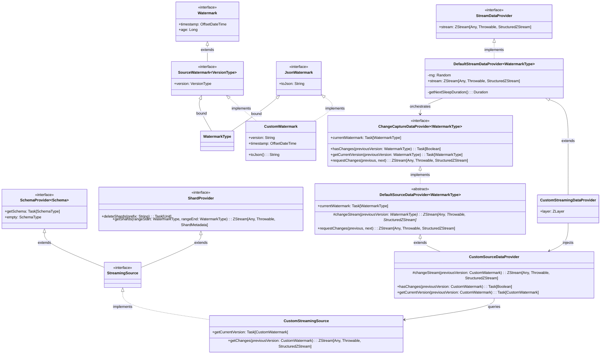

```mermaid
classDiagram
    %% Core Interfaces & Traits
    class StreamDataProvider {
        <<interface>>
        +stream: ZStream[Any, Throwable, StructuredZStream]
    }

    class ChangeCaptureDataProvider~WatermarkType~ {
        <<interface>>
        +hasChanges(previousVersion: WatermarkType): Task[Boolean]
        +getCurrentVersion(previousVersion: WatermarkType): Task[WatermarkType]
        +requestChanges(previous, next): ZStream[Any, Throwable, StructuredZStream]
        +currentWatermark: Task[WatermarkType]
    }

    class Watermark {
        <<interface>>
        +timestamp: OffsetDateTime
        +age: Long
    }

    class SourceWatermark~VersionType~ {
        <<interface>>
        +version: VersionType
    }

    class JsonWatermark {
        <<interface>>
        +toJson: String
    }

    class SchemaProvider~Schema~ {
        <<interface>>
        +getSchema: Task[SchemaType]
        +empty: SchemaType
    }

    class ShardProvider {
        <<interface>>
        +deleteShards(prefix: String): Task[Unit]
        +getShards(rangeStart: WatermarkType, rangeEnd: WatermarkType): ZStream[Any, Throwable, ShardMetadata]
    }

    class StreamingSource {
        <<interface>>
    }

    %% Abstract & Default Classes
    class DefaultStreamDataProvider~WatermarkType~ {
        -rng: Random
        -getNextSleepDuration(): Duration
        +stream: ZStream[Any, Throwable, StructuredZStream]
    }

    class DefaultSourceDataProvider~WatermarkType~ {
        <<abstract>>
        #changeStream(previousVersion: WatermarkType): ZStream[Any, Throwable, StructuredZStream]*
        +requestChanges(previous, next): ZStream[Any, Throwable, StructuredZStream]
        +currentWatermark: Task[WatermarkType]
    }

    %% Example Concrete Implementations
    class CustomWatermark {
        +version: String
        +timestamp: OffsetDateTime
        +toJson(): String
    }

    class CustomStreamingDataProvider {
        +layer: ZLayer
    }

    class CustomSourceDataProvider {
        #changeStream(previousVersion: CustomWatermark): ZStream[Any, Throwable, StructuredZStream]
        +hasChanges(previousVersion: CustomWatermark): Task[Boolean]
        +getCurrentVersion(previousVersion: CustomWatermark): Task[CustomWatermark]
    }

    class CustomStreamingSource {
        +getChanges(previousVersion: CustomWatermark): ZStream[Any, Throwable, StructuredZStream]
        +getCurrentVersion: Task[CustomWatermark]
    }

    %% Relationships
    StreamDataProvider <|.. DefaultStreamDataProvider : implements
    ChangeCaptureDataProvider <|.. DefaultSourceDataProvider : implements
    DefaultStreamDataProvider --> ChangeCaptureDataProvider : orchestrates

    Watermark <|-- SourceWatermark : extends
    SourceWatermark <|-- WatermarkType : bound
    JsonWatermark <|-- WatermarkType : bound

    SchemaProvider <|-- StreamingSource : extends
    ShardProvider <|-- StreamingSource : extends

    SourceWatermark <|.. CustomWatermark : implements
    JsonWatermark <|.. CustomWatermark : implements

    DefaultStreamDataProvider <|-- CustomStreamingDataProvider : extends
    DefaultSourceDataProvider <|-- CustomSourceDataProvider : extends
    StreamingSource <|.. CustomStreamingSource : implements

    CustomStreamingDataProvider --> CustomSourceDataProvider : injects
    CustomSourceDataProvider --> CustomStreamingSource : queries
```