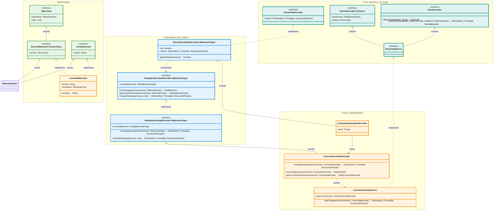

```mermaid
classDiagram
    %% Direction of diagram flow
    direction TB

    %% ======================================================
    %% NAMESPACES & CLASSES
    %% ======================================================

    namespace Core_Interfaces_and_Traits {
        class StreamDataProvider {
            <<interface>>
            +stream: ZStream[Any, Throwable, StructuredZStream]
        }
        class SchemaProvider~Schema~ {
            <<interface>>
            +getSchema: Task[SchemaType]
            +empty: SchemaType
        }
        class ShardProvider {
            <<interface>>
            +deleteShards(prefix: String): Task[Unit]
            +getShards(rangeStart: WatermarkType, rangeEnd: WatermarkType): ZStream[Any, Throwable, ShardMetadata]
        }
        class StreamingSource {
            <<interface>>
        }
    }

    namespace Orchestration_and_Emitters {
        class ChangeCaptureDataProvider~WatermarkType~ {
            <<interface>>
            +hasChanges(previousVersion: WatermarkType): Task[Boolean]
            +getCurrentVersion(previousVersion: WatermarkType): Task[WatermarkType]
            +requestChanges(previous, next): ZStream[Any, Throwable, StructuredZStream]
            +currentWatermark: Task[WatermarkType]
        }
        class DefaultStreamDataProvider~WatermarkType~ {
            -rng: Random
            -getNextSleepDuration(): Duration
            +stream: ZStream[Any, Throwable, StructuredZStream]
        }
        class DefaultSourceDataProvider~WatermarkType~ {
            <<abstract>>
            #changeStream(previousVersion: WatermarkType): ZStream[Any, Throwable, StructuredZStream]*
            +requestChanges(previous, next): ZStream[Any, Throwable, StructuredZStream]
            +currentWatermark: Task[WatermarkType]
        }
    }

    namespace Watermarking {
        class Watermark {
            <<interface>>
            +timestamp: OffsetDateTime
            +age: Long
        }
        class SourceWatermark~VersionType~ {
            <<interface>>
            +version: VersionType
        }
        class JsonWatermark {
            <<interface>>
            +toJson: String
        }
        class CustomWatermark {
            +version: String
            +timestamp: OffsetDateTime
            +toJson(): String
        }
    }

    namespace Custom_Implementation {
        class CustomStreamingDataProvider {
            +layer: ZLayer
        }
        class CustomSourceDataProvider {
            #changeStream(previousVersion: CustomWatermark): ZStream[Any, Throwable, StructuredZStream]
            +hasChanges(previousVersion: CustomWatermark): Task[Boolean]
            +getCurrentVersion(previousVersion: CustomWatermark): Task[CustomWatermark]
        }
        class CustomStreamingSource {
            +getChanges(previousVersion: CustomWatermark): ZStream[Any, Throwable, StructuredZStream]
            +getCurrentVersion: Task[CustomWatermark]
        }
    }

    %% ======================================================
    %% STYLING DEFINITIONS
    %% ======================================================
    style StreamDataProvider fill:#e0f2f1,stroke:#00897b,stroke-width:2px
    style SchemaProvider fill:#e0f2f1,stroke:#00897b,stroke-width:2px
    style ShardProvider fill:#e0f2f1,stroke:#00897b,stroke-width:2px
    style StreamingSource fill:#e0f2f1,stroke:#00897b,stroke-width:2px

    style ChangeCaptureDataProvider fill:#e3f2fd,stroke:#1e88e5,stroke-width:2px
    style DefaultStreamDataProvider fill:#e3f2fd,stroke:#1e88e5,stroke-width:2px
    style DefaultSourceDataProvider fill:#e3f2fd,stroke:#1e88e5,stroke-width:2px

    style Watermark fill:#e8f5e9,stroke:#43a047,stroke-width:2px
    style SourceWatermark fill:#e8f5e9,stroke:#43a047,stroke-width:2px
    style JsonWatermark fill:#e8f5e9,stroke:#43a047,stroke-width:2px
    style CustomWatermark fill:#fff3e0,stroke:#fb8c00,stroke-width:2px

    style CustomStreamingDataProvider fill:#fff3e0,stroke:#fb8c00,stroke-width:2px
    style CustomSourceDataProvider fill:#fff3e0,stroke:#fb8c00,stroke-width:2px
    style CustomStreamingSource fill:#fff3e0,stroke:#fb8c00,stroke-width:2px

    %% ======================================================
    %% RELATIONSHIPS & INHERITANCE
    %% ======================================================
    
    %% Base Framework Relationships
    StreamDataProvider <|.. DefaultStreamDataProvider : implements
    ChangeCaptureDataProvider <|.. DefaultSourceDataProvider : implements
    DefaultStreamDataProvider --> ChangeCaptureDataProvider : orchestrates

    Watermark <|-- SourceWatermark : extends
    SourceWatermark <|-- WatermarkType : bound
    JsonWatermark <|-- WatermarkType : bound

    SchemaProvider <|-- StreamingSource : extends
    ShardProvider <|-- StreamingSource : extends

    %% Concrete Custom Implementations
    SourceWatermark <|.. CustomWatermark : implements
    JsonWatermark <|.. CustomWatermark : implements

    DefaultStreamDataProvider <|-- CustomStreamingDataProvider : extends
    DefaultSourceDataProvider <|-- CustomSourceDataProvider : extends
    StreamingSource <|.. CustomStreamingSource : implements

    CustomStreamingDataProvider --> CustomSourceDataProvider : injects
    CustomSourceDataProvider --> CustomStreamingSource : queries
```