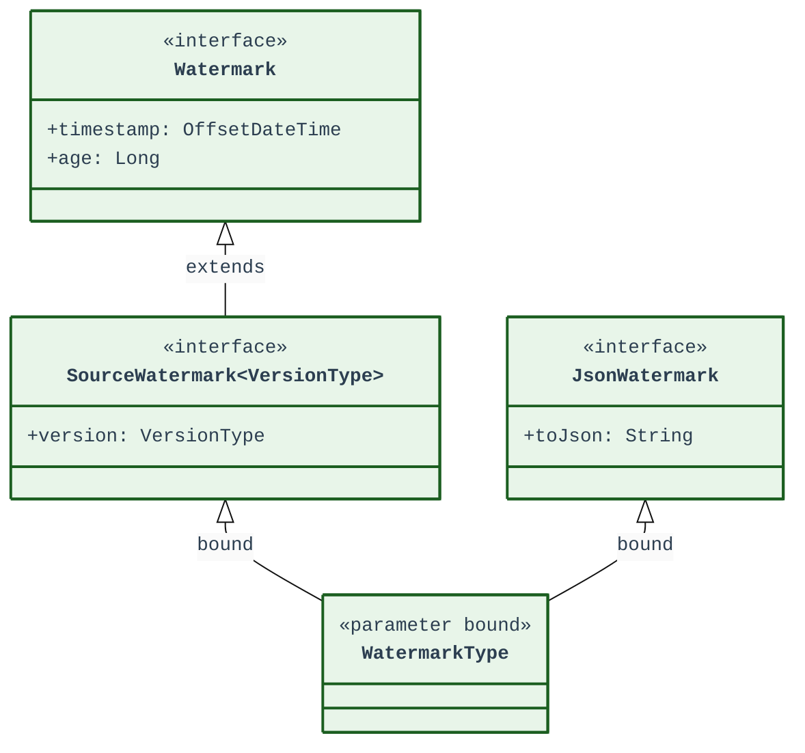
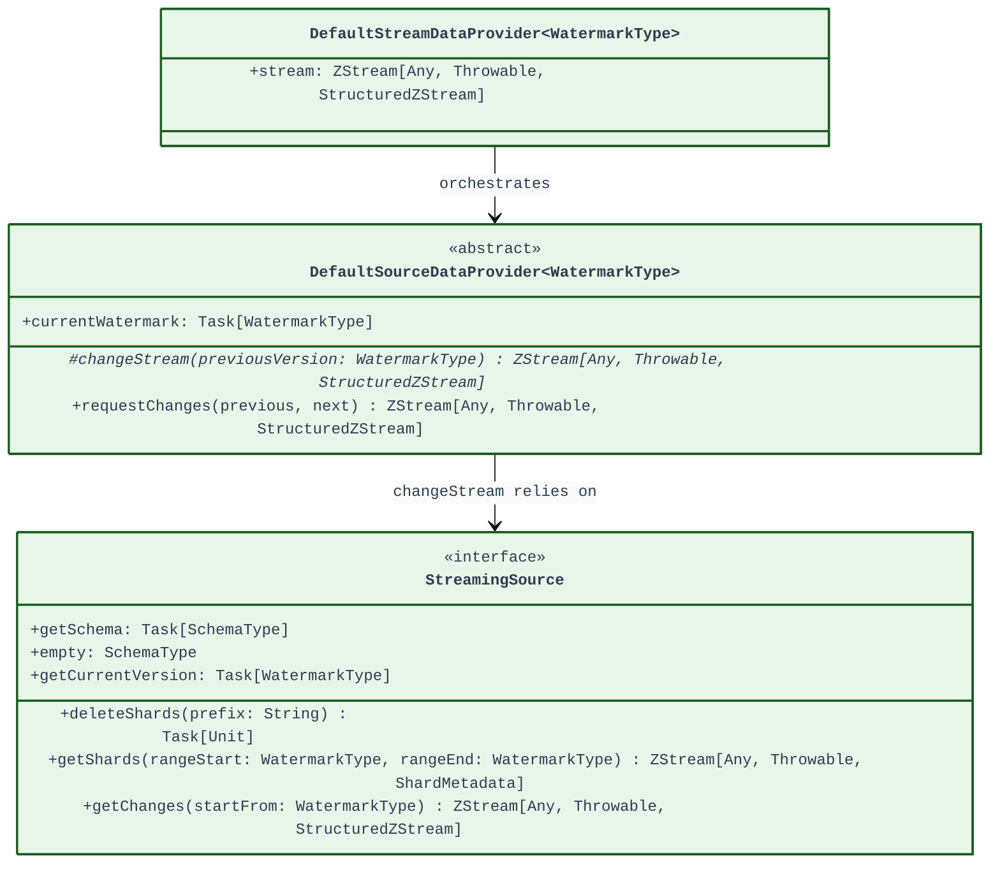
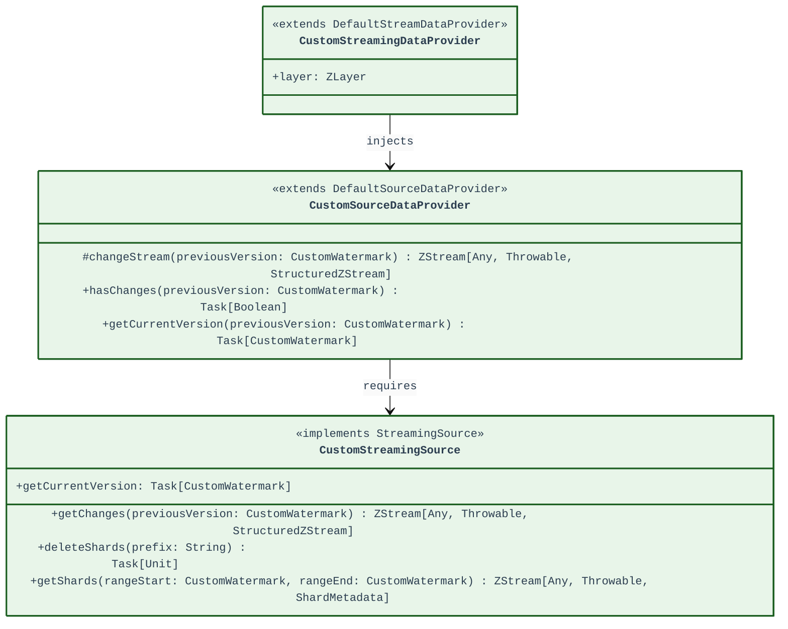

# Streaming Componetns Diagram for Developers

This document shows relations between components that are required by streaming graph builders. Developers must implement those when building a custom source for a new plugin.

---

## 1. Watermarking

Concrete implementation of a watermark is used to track stream progress in relation to source.

---

## 2. Change Capture Components

Classes that orchestrate change capture pipeline: extracting changes from source and incorporating them into a Iceberg table.

---

## 3. Custom Components Implementation

Concrete implementations of the components above, when provided, will automatically allow continuous data streaming from a custom source.

