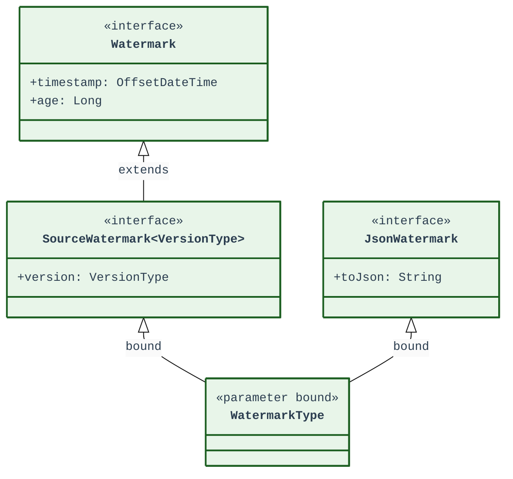
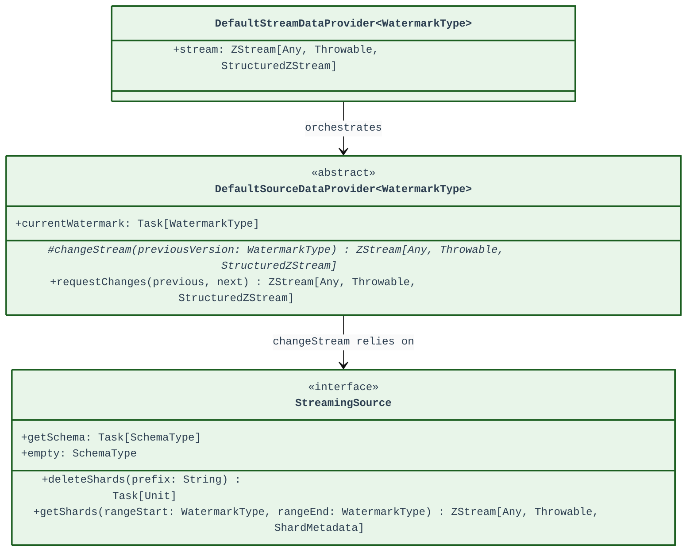
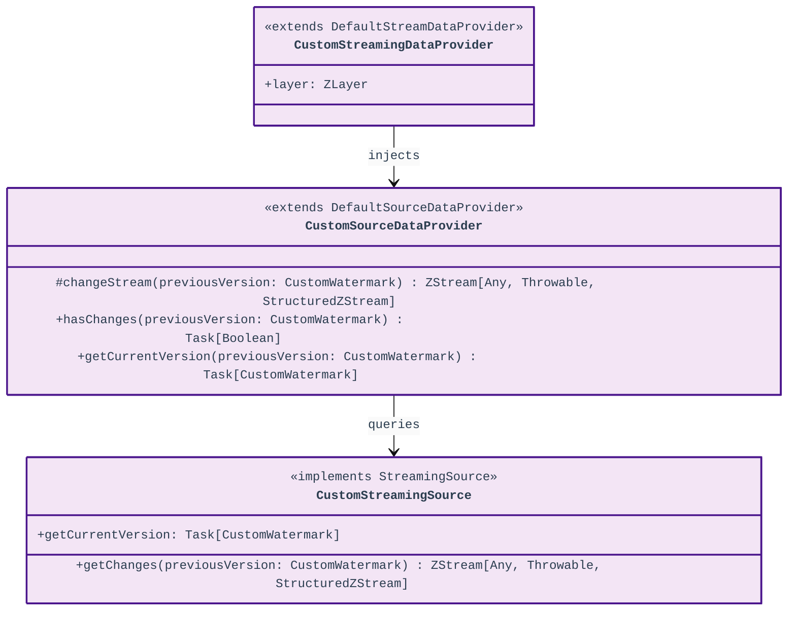

# Class Diagram

This document contains class diagrams for the Arcane framework, split into three parts: Framework Architecture, Custom Implementation, and Watermarking.

---

## 1. Watermarking Core

The watermarking core defines the types and interfaces for tracking partition/stream progress.

---

## 2. Framework Architecture

The framework orchestrates streaming data ingestion using a hierarchy of providers and change-capture components.

---

## 3. Custom Implementation

Concrete implementations showing how to extend the framework for custom data sources and watermark schemas.

