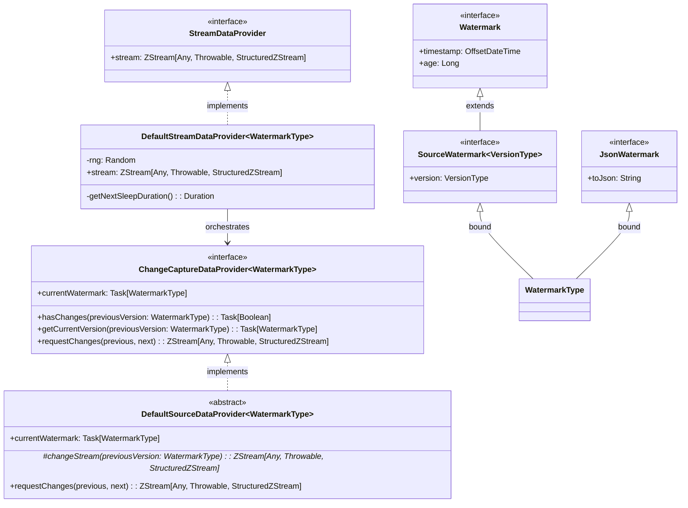

```mermaid
classDiagram
    %% Core Interfaces & Traits
    class StreamDataProvider {
        <<interface>>
        +stream: ZStream[Any, Throwable, StructuredZStream]
    }

    class ChangeCaptureDataProvider~WatermarkType~ {
        <<interface>>
        +hasChanges(previousVersion: WatermarkType): Task[Boolean]
        +getCurrentVersion(previousVersion: WatermarkType): Task[WatermarkType]
        +requestChanges(previous, next): ZStream[Any, Throwable, StructuredZStream]
        +currentWatermark: Task[WatermarkType]
    }

    class Watermark {
        <<interface>>
        +timestamp: OffsetDateTime
        +age: Long
    }

    class SourceWatermark~VersionType~ {
        <<interface>>
        +version: VersionType
    }

    class JsonWatermark {
        <<interface>>
        +toJson: String
    }

    %% Abstract & Default Classes
    class DefaultStreamDataProvider~WatermarkType~ {
        -rng: Random
        -getNextSleepDuration(): Duration
        +stream: ZStream[Any, Throwable, StructuredZStream]
    }

    class DefaultSourceDataProvider~WatermarkType~ {
        <<abstract>>
        #changeStream(previousVersion: WatermarkType): ZStream[Any, Throwable, StructuredZStream]*
        +requestChanges(previous, next): ZStream[Any, Throwable, StructuredZStream]
        +currentWatermark: Task[WatermarkType]
    }

    %% Relationships
    StreamDataProvider <|.. DefaultStreamDataProvider : implements
    ChangeCaptureDataProvider <|.. DefaultSourceDataProvider : implements
    DefaultStreamDataProvider --> ChangeCaptureDataProvider : orchestrates

    Watermark <|-- SourceWatermark : extends
    SourceWatermark <|-- WatermarkType : bound
    JsonWatermark <|-- WatermarkType : bound
```