## Render

```mermaid
%%{init: {
  'theme': 'base',
  'themeVariables': {
    'primaryColor': '#fafafa',
    'primaryTextColor': '#2c3e50',
    'primaryBorderColor': '#7f8c8d',
    'lineColor': '#111111',
    'arrowheadColor': '#111111',
    'secondaryColor': '#fdfdfd',
    'tertiaryColor': '#ffffff',
    'fontSize': '14px',
    'fontFamily': 'Fira Code, Menlo, Monaco, Consolas, Courier New, monospace'
  },
  'flowchart': {
    'curve': 'linear'
  },
  'class': {
    'curve': 'linear'
  }
} }%%
classDiagram
    %% Direction of diagram flow
    direction TB

    %% ======================================================
    %% ROW 1: THE FRAMEWORK ARCHITECTURE
    %% ======================================================
    
    %% Column 1: Watermarking Core
    class Watermark {
        <<interface>>
        +timestamp: OffsetDateTime
        +age: Long
    }
    class SourceWatermark~VersionType~ {
        <<interface>>
        +version: VersionType
    }
    class JsonWatermark {
        <<interface>>
        +toJson: String
    }

    %% Column 2: Stream Orchestration
    class StreamDataProvider {
        <<interface>>
        +stream: ZStream[Any, Throwable, StructuredZStream]
    }
    class DefaultStreamDataProvider~WatermarkType~ {
        -rng: Random
        -getNextSleepDuration(): Duration
        +stream: ZStream[Any, Throwable, StructuredZStream]
    }

    %% Column 3: Data Emitters / Providers
    class ChangeCaptureDataProvider~WatermarkType~ {
        <<interface>>
        +hasChanges(previousVersion: WatermarkType): Task[Boolean]
        +getCurrentVersion(previousVersion: WatermarkType): Task[WatermarkType]
        +requestChanges(previous, next): ZStream[Any, Throwable, StructuredZStream]
        +currentWatermark: Task[WatermarkType]
    }
    class DefaultSourceDataProvider~WatermarkType~ {
        <<abstract>>
        #changeStream(previousVersion: WatermarkType): ZStream[Any, Throwable, StructuredZStream]*
        +requestChanges(previous, next): ZStream[Any, Throwable, StructuredZStream]
        +currentWatermark: Task[WatermarkType]
    }

    %% Column 4: Physical Streaming Sources
    class SchemaProvider~Schema~ {
        <<interface>>
        +getSchema: Task[SchemaType]
        +empty: SchemaType
    }
    class ShardProvider {
        <<interface>>
        +deleteShards(prefix: String): Task[Unit]
        +getShards(rangeStart: WatermarkType, rangeEnd: WatermarkType): ZStream[Any, Throwable, ShardMetadata]
    }
    class StreamingSource {
        <<interface>>
    }

    %% ======================================================
    %% ROW 2: YOUR CUSTOM SOURCE IMPLEMENTATION
    %% ======================================================
    
    %% Column 1 implementation
    class CustomWatermark {
        +version: String
        +timestamp: OffsetDateTime
        +toJson(): String
    }

    %% Column 2 implementation
    class CustomStreamingDataProvider {
        +layer: ZLayer
    }

    %% Column 3 implementation
    class CustomSourceDataProvider {
        #changeStream(previousVersion: CustomWatermark): ZStream[Any, Throwable, StructuredZStream]
        +hasChanges(previousVersion: CustomWatermark): Task[Boolean]
        +getCurrentVersion(previousVersion: CustomWatermark): Task[CustomWatermark]
    }

    %% Column 4 implementation
    class CustomStreamingSource {
        +getChanges(previousVersion: CustomWatermark): ZStream[Any, Throwable, StructuredZStream]
        +getCurrentVersion: Task[CustomWatermark]
    }

    %% ======================================================
    %% STYLING DEFINITIONS
    %% ======================================================
    style StreamDataProvider fill:#e0f2f1,stroke:#004d40,stroke-width:2px
    style SchemaProvider fill:#e0f2f1,stroke:#004d40,stroke-width:2px
    style ShardProvider fill:#e0f2f1,stroke:#004d40,stroke-width:2px
    style StreamingSource fill:#e0f2f1,stroke:#004d40,stroke-width:2px

    style ChangeCaptureDataProvider fill:#e3f2fd,stroke:#0d47a1,stroke-width:2px
    style DefaultStreamDataProvider fill:#e3f2fd,stroke:#0d47a1,stroke-width:2px
    style DefaultSourceDataProvider fill:#e3f2fd,stroke:#0d47a1,stroke-width:2px

    style Watermark fill:#e8f5e9,stroke:#1b5e20,stroke-width:2px
    style SourceWatermark fill:#e8f5e9,stroke:#1b5e20,stroke-width:2px
    style JsonWatermark fill:#e8f5e9,stroke:#1b5e20,stroke-width:2px
    style CustomWatermark fill:#fff3e0,stroke:#e65100,stroke-width:2px

    style CustomStreamingDataProvider fill:#f3e5f5,stroke:#4a148c,stroke-width:2px
    style CustomSourceDataProvider fill:#f3e5f5,stroke:#4a148c,stroke-width:2px
    style CustomStreamingSource fill:#f3e5f5,stroke:#4a148c,stroke-width:2px

    %% ======================================================
    %% RELATIONSHIPS & INHERITANCE
    %% ======================================================
    
    %% Base Framework Relationships
    Watermark <|-- SourceWatermark : extends
    SourceWatermark <|-- WatermarkType : bound
    JsonWatermark <|-- WatermarkType : bound

    StreamDataProvider <|.. DefaultStreamDataProvider : implements
    DefaultStreamDataProvider --> ChangeCaptureDataProvider : orchestrates

    ChangeCaptureDataProvider <|.. DefaultSourceDataProvider : implements

    SchemaProvider <|-- StreamingSource : extends
    ShardProvider <|-- StreamingSource : extends

    %% Concrete Custom Implementations
    SourceWatermark <|.. CustomWatermark : implements
    JsonWatermark <|.. CustomWatermark : implements

    DefaultStreamDataProvider <|-- CustomStreamingDataProvider : extends
    DefaultSourceDataProvider <|-- CustomSourceDataProvider : extends
    StreamingSource <|.. CustomStreamingSource : implements

    CustomStreamingDataProvider --> CustomSourceDataProvider : injects
    CustomSourceDataProvider --> CustomStreamingSource : queries
```

[![](https://mermaid.ink/img/pako:eNrNWW1z2kYQ_is38rhOGnARLwY0bmZsjGtaAx6Qk0lCPpylFVwt3aknyTZxyG_v6QWhFwSYuDOFD0h3u8_tPre3uxLPksZ0kBTp8PCZUOIq6HlCETpyZ2DBkYKO7rADR6XV2AfMCb4zwTmKRMWEzYmF-bzDTMZ9nQMD-99QbTWvwpO7kqlqNWhUsjLnjOvAV1JNo6W19FjKJBRWk3LwiScx5-xxBlgvlHBAY1RPm6r731jCBe6StEDwiQUMRt0x-RZwI9ftp9TEJbaIOfenLgnHqCOoLaE-UJOJH0axJn47jDrMxI5_5XECHA3gsYQsRpljYw2OfLxFyLhhskdthrmbIFvz-EOwus8F5klxTcA620QndIEWh4cTGkhfEDzl2AoVDg_RBeGguYRRxAykh5PINyOU0ONp9XxCY63f9_rE6qPhRyQrSL3qosvRWb_7cTj6C52NOlc9tdtRb0fdV1koBhF761nUX_EjFvstwu6e0KkY5hDKBMysJpd8-p_TU0LFsCE26v371fA7l1jguNiyFTQ0DAfcC6GtisGEDJ6Cgq4ZnYZji-RiYxELGsRL_vgA3BE0q3Mbfuyy_kMor6CE4ppl_nQYfZlfzFdR0NjlJGF4lstqIAEiVoZcmwkmOPajJOVhMC9owTecPRBxyndZ3wm0FPQ5VP9yRuclpM7EQfeTUMlH9TTX46BHEl_XeH0BBvZMN2_Bj5iLHNFlTqcKGmGqMysxOgV3INLY2ASwL7zQyzdvFbS8fh3Ts_TWxALCbNS1iCsMdtBvaOmCk3S0M8N0Ch1s-7A7OlrE_Aw7IZzzxubwQJjnfFgGWQpNeK9i5_7LOWMmYPo1gSHY6nicA3Uj1R2hUoNJQA7_eCK6soaVEBWb8vblXAegWmhivOgGI9aGVXB0d2Yb3_mnQ3OTZB9ogUOhads52t3LX_9f3GXjuq6gm9ncIRo2o_zgJ-KQ0FRgj0VSsVb8hrc7hbEIwVA6siy8ycYVWLY7V9Bqcl2KFoVYf0nu0sEEFwK1gG6DPC0T6TLQb0XLlTkwkTwPA0LU_sz-l1Aw1aX6CwLDx-yDi3URpetCOSY_5H6Ld4vXLf2ieHwa3o5Q53asDvtoLK47XdTr31x3-92Beqb2hoP_pgNAxLJN0dRSN1euOp7jMmttrVwV22RV3LkNCEuqXzS2FdWt5sXbVlRW35l4DlwExrX_W1xftq-US3LJZbbkrwyX--aaTRUpv8RP1KQCsMzwhrS2-8blz1tg4O5u7sVkjoOdPfzJ4z5WP133Bn-gi-5lb9DzD_b4VaAdd27CuhbTIKapHEDFqBpySRRedg_KQaVS1-uV6Lb8SHR3plTtpxRUquDsD5OqGXujZKLlZThJpMIGcYlZE5j6ClOvN7G80bbC3vqnEfMZ52WIScxVHo8wWkYD2jGGfNeA6pY9SD-g7Y2TfgLbFyVbnUIcwzBqUIlx4KQhV7ZGxIZCEqHWoGE0YtQ6lustbQfrCjdwb8C1x2BXtFfrWLrXQUcyvurdjNEvqDe46o566tmg88qvKc6xA-iSYwsemdjiEZhBMXFmxI5649X-n34vl3MhqiDR2APVI-nsdKCT6iCFxh3zqB7KpyN1k3SEn08Bp9-PjzdkCGVVJyMbi2XL5fcbspeCWPzewX9yCNGK5VOG5eM0bVjkXroihIxnIjLLeCr7b9NIdBFU4-LJIQp71Es1E4W7KTzKpoU8wdlN3aq0bV8CrzYlkQwnxaQnkdZtSZraDI8JT_IU5_3ZZHAQacVmEPo3aEs6C-USIDlzxGM4J-BIJWnKiS4polODkmT59Pu3UtAMTqTgdftEUsSlHpI2kSZ0IdRsTD8zZi01OfOmM0kxsOmIO88WD3kQvdeNR0WvF7xX96grKe3mSQAiKc_Sk6SU5Yp8XG3JLbndbtcrzXZDLklzSZGrtePGSbXRblTkSuukLZ8sStK3YOFAvlKtyifVZr3WbDerJQl04jLeD_9OCP5VWPwLZazz4w?type=png)](https://mermaid.ai/live/edit#pako:eNrNWW1z2kYQ_is38rhOGnARLwY0bmZsjGtaAx6Qk0lCPpylFVwt3aknyTZxyG_v6QWhFwSYuDOFD0h3u8_tPre3uxLPksZ0kBTp8PCZUOIq6HlCETpyZ2DBkYKO7rADR6XV2AfMCb4zwTmKRMWEzYmF-bzDTMZ9nQMD-99QbTWvwpO7kqlqNWhUsjLnjOvAV1JNo6W19FjKJBRWk3LwiScx5-xxBlgvlHBAY1RPm6r731jCBe6StEDwiQUMRt0x-RZwI9ftp9TEJbaIOfenLgnHqCOoLaE-UJOJH0axJn47jDrMxI5_5XECHA3gsYQsRpljYw2OfLxFyLhhskdthrmbIFvz-EOwus8F5klxTcA620QndIEWh4cTGkhfEDzl2AoVDg_RBeGguYRRxAykh5PINyOU0ONp9XxCY63f9_rE6qPhRyQrSL3qosvRWb_7cTj6C52NOlc9tdtRb0fdV1koBhF761nUX_EjFvstwu6e0KkY5hDKBMysJpd8-p_TU0LFsCE26v371fA7l1jguNiyFTQ0DAfcC6GtisGEDJ6Cgq4ZnYZji-RiYxELGsRL_vgA3BE0q3Mbfuyy_kMor6CE4ppl_nQYfZlfzFdR0NjlJGF4lstqIAEiVoZcmwkmOPajJOVhMC9owTecPRBxyndZ3wm0FPQ5VP9yRuclpM7EQfeTUMlH9TTX46BHEl_XeH0BBvZMN2_Bj5iLHNFlTqcKGmGqMysxOgV3INLY2ASwL7zQyzdvFbS8fh3Ts_TWxALCbNS1iCsMdtBvaOmCk3S0M8N0Ch1s-7A7OlrE_Aw7IZzzxubwQJjnfFgGWQpNeK9i5_7LOWMmYPo1gSHY6nicA3Uj1R2hUoNJQA7_eCK6soaVEBWb8vblXAegWmhivOgGI9aGVXB0d2Yb3_mnQ3OTZB9ogUOhads52t3LX_9f3GXjuq6gm9ncIRo2o_zgJ-KQ0FRgj0VSsVb8hrc7hbEIwVA6siy8ycYVWLY7V9Bqcl2KFoVYf0nu0sEEFwK1gG6DPC0T6TLQb0XLlTkwkTwPA0LU_sz-l1Aw1aX6CwLDx-yDi3URpetCOSY_5H6Ld4vXLf2ieHwa3o5Q53asDvtoLK47XdTr31x3-92Beqb2hoP_pgNAxLJN0dRSN1euOp7jMmttrVwV22RV3LkNCEuqXzS2FdWt5sXbVlRW35l4DlwExrX_W1xftq-US3LJZbbkrwyX--aaTRUpv8RP1KQCsMzwhrS2-8blz1tg4O5u7sVkjoOdPfzJ4z5WP133Bn-gi-5lb9DzD_b4VaAdd27CuhbTIKapHEDFqBpySRRedg_KQaVS1-uV6Lb8SHR3plTtpxRUquDsD5OqGXujZKLlZThJpMIGcYlZE5j6ClOvN7G80bbC3vqnEfMZ52WIScxVHo8wWkYD2jGGfNeA6pY9SD-g7Y2TfgLbFyVbnUIcwzBqUIlx4KQhV7ZGxIZCEqHWoGE0YtQ6lustbQfrCjdwb8C1x2BXtFfrWLrXQUcyvurdjNEvqDe46o566tmg88qvKc6xA-iSYwsemdjiEZhBMXFmxI5649X-n34vl3MhqiDR2APVI-nsdKCT6iCFxh3zqB7KpyN1k3SEn08Bp9-PjzdkCGVVJyMbi2XL5fcbspeCWPzewX9yCNGK5VOG5eM0bVjkXroihIxnIjLLeCr7b9NIdBFU4-LJIQp71Es1E4W7KTzKpoU8wdlN3aq0bV8CrzYlkQwnxaQnkdZtSZraDI8JT_IU5_3ZZHAQacVmEPo3aEs6C-USIDlzxGM4J-BIJWnKiS4polODkmT59Pu3UtAMTqTgdftEUsSlHpI2kSZ0IdRsTD8zZi01OfOmM0kxsOmIO88WD3kQvdeNR0WvF7xX96grKe3mSQAiKc_Sk6SU5Yp8XG3JLbndbtcrzXZDLklzSZGrtePGSbXRblTkSuukLZ8sStK3YOFAvlKtyifVZr3WbDerJQl04jLeD_9OCP5VWPwLZazz4w)

