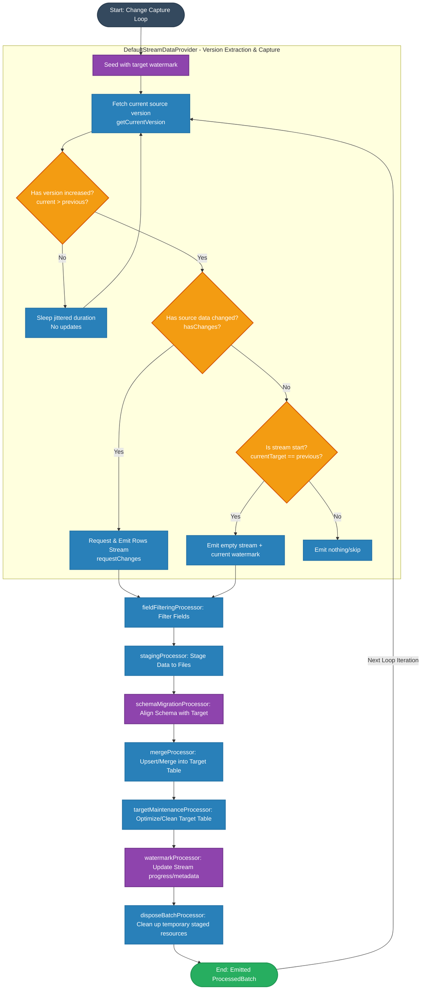

# DefaultStreamingGraphBuilder

## Overview

The `DefaultStreamingGraphBuilder` constructs the continuous streaming graph for reactive, real-time data ingestion. It provides the full data pipeline that extracts batches of streaming records from a source, applies required transformations, handles staging, performs schema migrations, merges values into the target table, executes target catalog maintenance, commits the stream watermark progress, and cleans up staging resources.

Unlike backfill graph builders, `DefaultStreamingGraphBuilder` processes the streams continuously and indefinitely as long as the source provider remains active.

---

## Execution Flow

The streaming pipeline is designed as a sequence of stages connected via ZIO Stream pipelines (`via` operators), processing each emitted pair of `(subStream, schema)`. The flow is as follows:

1. **Source Stream (`streamDataProvider`)**
   Emits the continuous data stream as pairs of `(subStream, schema)`, where `subStream` is a `ZStream` of rows and `schema` is the schema of the rows in that stream.

2. **Field Filtering (`fieldFilteringProcessor`)**
   Filters columns/fields from the incoming data based on the dynamic configured field selection and matching rules, ensuring only required attributes are ingested.

3. **Data Staging (`stagingProcessor`)**
   Stages the active stream data rows into Iceberg tables in the staging catalog.

4. **Schema Migration (`schemaMigrationProcessor`)**
   Compares the active staging schema with the target table schema. If any changes are detected (such as new columns), it safely executes metadata schema migrations on the target catalog to guarantee alignment before merging.

5. **Data Merging (`mergeProcessor`)**
   Constructs and executes the merge transaction to incorporate the newly staged rows into the primary target table. Handles data de-duplication as a bonus.

6. **Target Maintenance (`targetMaintenanceProcessor`)**
   Performs routine metadata optimizations and maintenance transactions on the target catalog, such as snapshot expiration, removing orphaned files, or compacting.

7. **Watermark Management (`watermarkProcessor`)**
   Registers and persists the watermark progress for the successfully processed batch, updating table/catalog properties to enable checkpointing and safe restart/resumption of the stream.

8. **Batch Disposal (`disposeBatchProcessor`)**
   Cleans up temporary resources, dropping the staging tables.

## Stream Initialization: DefaultStreamDataProvider

The processing pipeline is initialized by the `DefaultStreamDataProvider`, which continuously monitors the source for new data changes:

- **Version Polling & Jitter**: Periodically polls the source for latest change version with randomized polling jitter to avoid herd behavior.
- **Change Detection**: Compares the version extracted from source to a version from the previous loop. On diff, checks if target entity in the source has data modifications. If yes, it emits the changeset as a ZStream.
- **Watermark Conservation**: If a version change exists without data changes, it emits only the updated watermark metadata to prevent target watermark properties from aging infinitely.

---

## Visual Processing Flow

Below is the visual pipeline representation of the `DefaultStreamingGraphBuilder` execution sequence, highlighting the internal loop and version extraction logic of `DefaultStreamDataProvider`:

